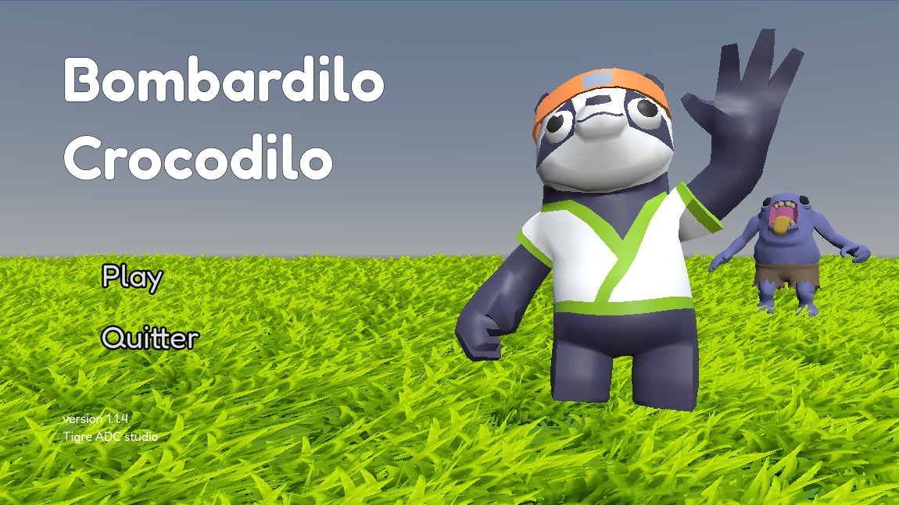
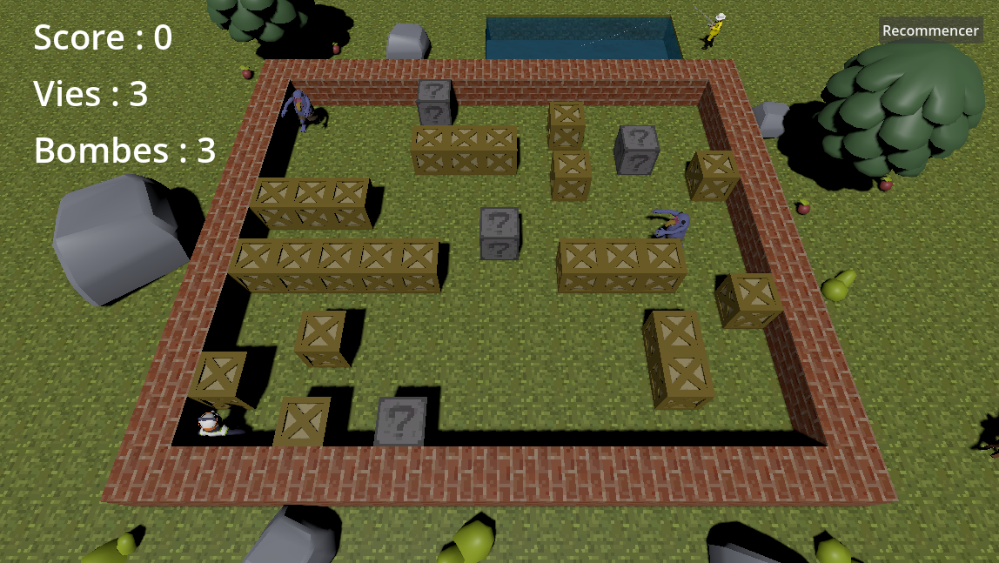

# 🐊💣 Bombardilo Crocodilo

**Une aventure explosive en 3D où stratégie et réflexes sont vos meilleures armes.**

[Jouer sur Itch.io](https://votre-pseudo.itch.io/bombardilo-crocodilo) • [Rapport de Bug](https://github.com/votre-username/votre-depot/issues)

---

## À propos du jeu

**Bombardilo Crocodilo** est un jeu d'arcade tactique inspiré des classiques du genre "Bomberman", développé sous **Godot Engine 4**.

Incarnez un Panda maître des explosifs piégé dans un labyrinthe infesté de zombies et de murs destructibles. Votre mission ? Survivre, ouvrir un chemin à coup de TNT et trouver le portail de sortie avant que le temps (ou les ennemis) ne vous rattrape.

> *"Un hommage moderne aux classiques d'arcade avec une touche de 3D stylisée."*

---

## Fonctionnalités Principales

* **Système de Destruction Dynamique :** Utilisez des bombes pour pulvériser les murs et redessiner le terrain de jeu (basé sur `GridMap`).
* **IA Ennemie :** Des zombies qui patrouillent et réagissent à votre présence. Ne restez pas coincé !
* **Power-Ups & Loot :** Améliorez votre arsenal en ramassant des bonus (Portée d'explosion, Nombre de bombes).
* **Caméra Dynamique :** Un système de suivi fluide qui garde l'action au centre de l'écran avec des effets de tremblement (Screen Shake) lors des explosions.
* **Interface Soignée :** Un menu principal en 3D immersive, des animations de personnages fluides et un HUD clair.

---

## Contrôles

| Action | Touche (Clavier) |
| :--- | :---: |
| **Déplacement** | `W`, `A`, `S`, `D` ou `Flèches Directionnelles` |
| **Poser une Bombe** | `Espace` |

---

## Aspects Techniques

Ce projet a été réalisé dans le cadre d'un TD universitaire. Voici les points techniques clés mis en œuvre :

* **Gestion de la Grille :** Utilisation de `GridMap` pour le niveau et conversion de coordonnées 3D <-> Grille pour le placement précis des bombes.
* **Détection de Collisions :** Utilisation intensive de `RayCast3D` pour empêcher le joueur de traverser les murs ou de poser des bombes les unes sur les autres.
* **Optimisation Web (HTML5) :**
    * Utilisation de `preload` pour les assets critiques (Sons, Particules).
    * Gestion du "Shader Warning" pour éviter les lags lors de la première explosion.
* **Architecture Nodale :** Séparation propre des scènes (Player, Bomb, Enemy, UI) et communication via des **Signaux**.

---

## L'Équipe de Développement

Projet réalisé en binôme :

| Membre | Rôle & Contributions | GitHub |
| :--- | :--- | :---: |
| **Achraf Ameri** | **Lead Gameplay & Core Mechanics** Système de mouvement, Logique des bombes, Gestion des vies/Respawn, Optimisation Web. | [@AchrafAmeri](https://github.com/AchrafAmeri) |
| **David Tran** | **IA & Level Design** Intelligence artificielle des ennemis, Caméra dynamique, Système de Loot, Génération de niveau. | [@PseudoBinome](https://github.com/DavidTRANMinhAnh) |

---

## Galerie

| Menu Principal | Gameplay Explosion |
| :---: | :---: |
|  |  |

---

*Fait avec ❤️ et beaucoup de café sur Godot Engine.*

